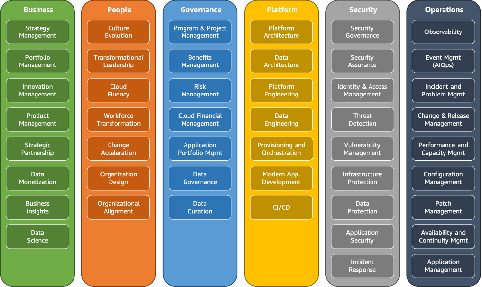

# Amazon Web Services (AWS) Cloud Practitioner

This section has my notes to prepare the  [AWS Certified Cloud Practitioner](https://aws.amazon.com/certification/certified-cloud-practitioner/) exam. 

I created these notes after following 

- the Udemy tutorial/course by Stephane Maarek [Ultimate AWS Certified Cloud Practitioner](https://www.udemy.com/course/aws-certified-cloud-practitioner-new).
- and the Datacamp courses [Introduction to AWS](https://app.datacamp.com/learn/courses/introduction-to-aws) and [Introduction to AWS Boto in Python](https://app.datacamp.com/learn/courses/introduction-to-aws-boto-in-python).

Mikel Sagardia, 2024.  
No guarantees.

## Table of Contents

- [Amazon Web Services (AWS) Cloud Practitioner](#amazon-web-services-aws-cloud-practitioner)
  - [Table of Contents](#table-of-contents)
  - [Setup](#setup)
  - [Introduction to AWS (Datacamp)](#introduction-to-aws-datacamp)
    - [Introduction to AWS Boto in Python](#introduction-to-aws-boto-in-python)
  - [Introduction to the AWS Cloud Practitioner Certification (Udemy, Stephane Maarek)](#introduction-to-the-aws-cloud-practitioner-certification-udemy-stephane-maarek)

## Setup

- Create account. There are several access accounts:
  - Root: the usual first account created, with all privileges, that should not be used in practice.
  - IAM: user accounts for specific tasks/applications and specific permissions.
  - *Note: there is a new sign-in coming, which hides the root sign-in...*

## Introduction to AWS (Datacamp)

- Benefits of AWS:
  - Pay for what you use, no need to setup complex HW infrastructure.
  - It benefits for economies of scale: a large user-base allows cheaper services
  - No more guessing capacity; instant scaling.
  - Increased speed and agility.
  - Save money on datacenters.
  - Go global in minutes.

- Services that can be accessed via the AWS Console:
  - **Billing and Cost Management**
    - Have a look at the *Getting Started* tab in the left column menu!
  - **S3** storage
  - **CloudFront**: content delivery network used to send content like images, videos and more quickly
  - and many more!

- The Six Pillars of AWS Platform are the principles that Amazon follows:
  - Security: Identity and Access Management
  - Cost Optimization: Avoid high costs
  - Performance Efficiency: Optimal performance
  - Sustainability: Environmental goals
  - Operational Excellence: Monitoring, reliability, etc.
  - Reliability: Resilience, horizontal scaling, recovery from failure, etc.

- Migration to the cloud:
  - On premises -> Cloud
  - AWS has the *AWS Cloud Adoption Framework (CAF)*, which follows the [AWS CAF perspectives and foundational capabilities](https://docs.aws.amazon.com/whitepapers/latest/overview-aws-cloud-adoption-framework/foundational-capabilities.html) that are valuable for cloud migration
  - Strategies for migrating to the cloud:
    - AWS Database Migration Service (DMS): we replicate DBs we have/has on premise on the Cloud; operation is kept uninterrupted during the transition.
    - AWS Snowball: Physical data transport for large-scale migrations (quick and secure, no internet connections used).

[AWS CAF perspectives and foundational capabilities](https://docs.aws.amazon.com/whitepapers/latest/overview-aws-cloud-adoption-framework/foundational-capabilities.html):

### Introduction to AWS Boto in Python

## Introduction to the AWS Cloud Practitioner Certification (Udemy, Stephane Maarek)

